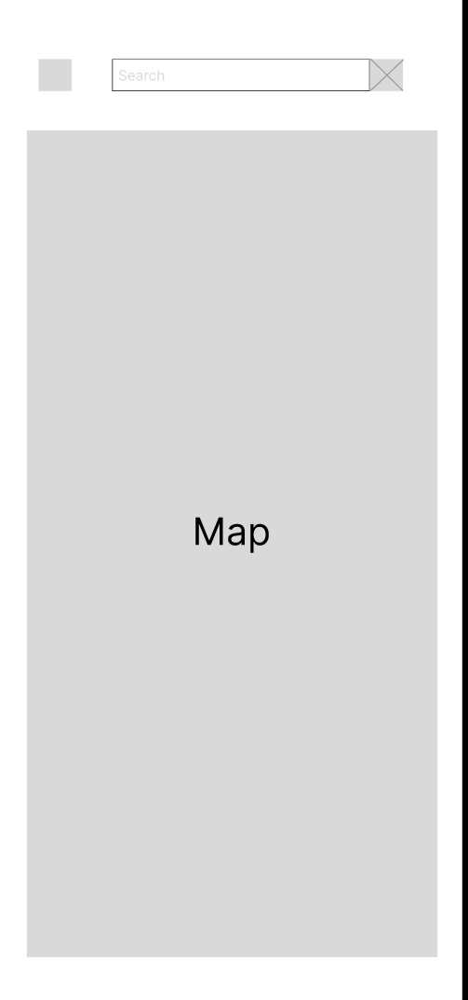
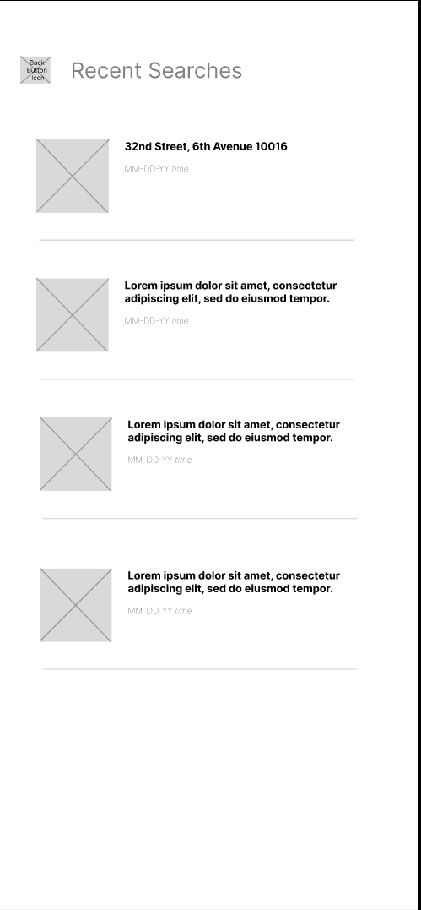

# Parkit!

## Overview

Parking in NYC can get very expensive and finding a street parking spot is difficult. Even worse, checking the signs on every street for available parking times and rules makes it even worse. With Parkit!, checking these rules is no longer difficult.

Parkit! is a web app that will allow users to search street parking rules for each street. Users can register and login to save recent searches as well as search parking rules for any street nearby or far in Manhattan, NYC. 

** The parking regulation data is currently (December 2022~) strictly limited to Manhattan area and will not display any regulations outside this area.


## Build Notes
<details>
<summary>Click here</summary>

### Milestone 1 (10/25/22)
Successful sketch/brainstorm
### Milestone 2 (11/18/22)
 Important note regarding deployment of form: </br>
1. Currently, in localhost, able to successfully bring in API data from opencurb with flexible GeoJSON values. <br>
2. However, needs resolving Mixed Error in Heroku in order to show this data in console. <br>
3. Currently able to receive GeoJSON, specifically lat,long,center from user actions on google maps such as dragging, zooming out (changing bounds/places). Please check the console on browser to confirm this data fetching successful.
<br>

Important note regarding change in research topics: <br>
 1. ArcGIS was costly and Google Maps API is free (to an extent) and for the purposes of this project, Google Maps was deemed more suitable.
 2. Removed React.js and decided to implement frontend with HTML/CSS/JS as it deemed more suitable.

### Milestone 3 (11/21/22)
1. React.js topic removed as not sufficient amount of front-end is needed that has to be aligned with data.
2. Routing for registration/login/session has been implemented, still needs final cleaning and front-end implementation.
3. Need to implement front-end for displaying API data
4. Basic UI has been implemented for homepage.
5. Added CSS reset to every page to hide the HTML default designs.

### Milestone 4 (Final ~12/02/22)
1. Using Google Maps API shapes:polyline, was able to draw lines based on the lat.lng geometries pulled from opencurb api and display different colors for the current parking status.
2. All css elements have been designed with colors within a color palette (look in :root)
3. Able to save Search History of each user and display up to three searches with new instances of google maps for each history
4. Enabled guest mode as default and can log in to use more functionality such as viewing Search History and reporting issues
5. Sign up form displays correct error messages to the user

</details>

## Data Model

The application will store Users, emails and Passwords.</br>
The feedback data will store the userid of submission and contents. </br>
The search data will store the accessed address, time, userid and user coordinates.

An Example User:

```javascript
{
  username: "username"
  email: "email"
  password: "password"
}
```

An Example Search:

```javascript
{
  address: "address"
  time: "timestamp"
  userid: "username._id"
  userlat: "user coordinate latitutde"
  userlng: "user coordinate longitude"
}
```
An Example Feedback:

```javascript
{
  userid: "username._id"
  category: "category"
  comment: "comment"
  time: "timestamp"
}
```

## [Link to Commented First Draft Schema](db.mjs) 

## Wireframes

Login Page


Signup Page


Main Page (Map Page)



Main Page Overlay (onclick, search)


Recent search Page



## Site map

[Site Map](documentation/site-map.png)

## User Stories or Use Cases

1. As a non-registered user, I can sign up and create an account.
2. As a user, I can navigate through the map.
3. As a user, I can search addresses or click specific areas on map to access parking limit data.
4. As a user, I can access a list of recent searches and access them again.
5. As a user, I can add comments to each parking limits data in case they are faulty.


## Annotations / References Used

1. [OpenCurb NYC API](http://www.opencurb.nyc/doc.html) 
2. [Google Maps Javascript API](https://developers.google.com/maps/documentation/javascript/overview)
3. [CSS Reset Cleanup](https://github.com/elad2412/the-new-css-reset)


## Ending Notes
<details>
<summary>Click here</summary>

## Possible Future Improvements

1. More Transparent Data : Opencurb API does not provide the most straightforward documentation for using its data and their data is pulled from several sources, hence it is hard to check the validity unless user himself/herself checks and reports
2. User-shareable Data: Currently allows user to report issues via form and stores in database, but I can't target the exact polyline of the map as it keeps overwriting data every time an event such as zoom-in, zoom-out happens so rendering this user-supplied data on each infoWindow is arbitrary at the moment. Current implementation serves functionality for developers as the stored data has GeoCode.
3. Front End Visuals : Overall design and visuals could be improved and code can be refactored to be clearer if using a front-end library
4. GPS : Could use GPS or location services to locate user on the map and center the map based on user's location. Currently defaulted to NYU/Washington Square Park area

</details>