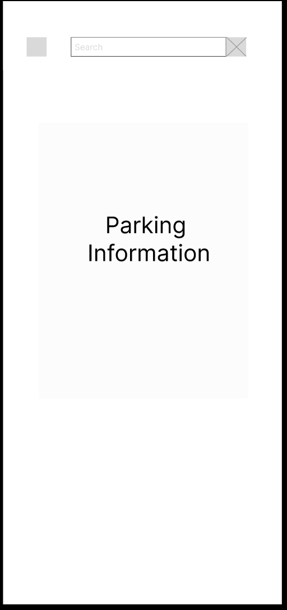

# Parkit!

## Overview

Parking in NYC can get very expensive and finding a street parking spot is difficult. Even worse, checking the signs on every street for available parking times and rules makes it even worse. With Parkit!, checking these rules is no longer difficult.

Parkit! is a web app that will allow users to search street parking rules for each street. Users can register and login to save recent searches as well as search parking rules for any street nearby or far in Manhattan, NYC. 

## Data Model

The application will store Users and Passwords and a list of data per user.</br>
The data will store the accessed address, time, username and user location.

An Example User:

```javascript
{
  username: "username"
  password: "password"
  list: "data"
}
```

An Example Data:

```javascript
{
  address: "address"
  time: "time-searched"
  userid: "username"
  usercoordinate: "coordinate"
}
```


## [Link to Commented First Draft Schema](db.mjs) 

## Wireframes

Login Page


Signup Page


Main Page (Map Page)


Main Page Overlay (onclick, search)



Recent search Page


## Site map

[Site Map](documentation/site-map.png)

## User Stories or Use Cases

1. As a non-registered user, I can sign up and create an account.
2. As a user, I can navigate through the map.
3. As a user, I can search addresses or click specific areas on map to access parking limit data.
4. As a user, I can access a list of recent searches and access them again.
5. As a user, I can add comments to each parking limits data in case they are faulty.

## Research Topics

* (3 points) dotenv
  * use dotenv to store credentials for mongoDB URI
* (5 points) React
  * use React.js as the frontend framework
* (5 points) OpenCurb API
  * use opencurb.nyc API to poll in NYC Street Parking Data
* (8 points) ArcGIS API
    * use ArcGIS API to build interactive maps

21 points total out of 8 required points 


## [Link to Initial Main Project File](app.mjs) 

## Annotations / References Used

1. [OpenCurb NYC API](http://www.opencurb.nyc/doc.html) 
2. [ArcGIS Documentation](https://developers.arcgis.com/javascript/latest/) 
3. [React.js Documentation](https://reactjs.org/tutorial/tutorial.html)
